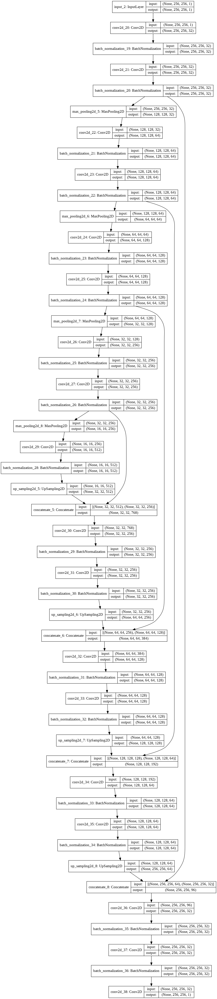
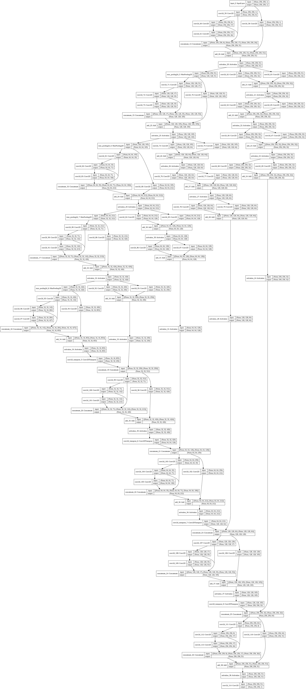
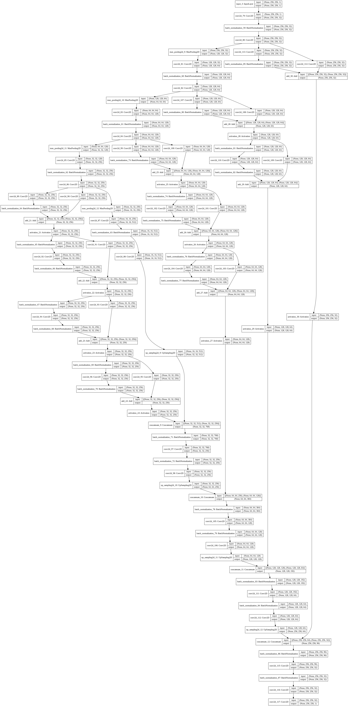
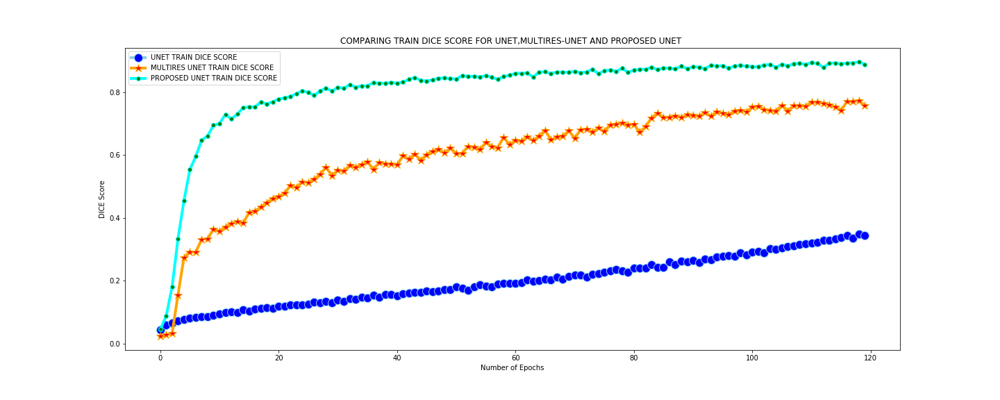
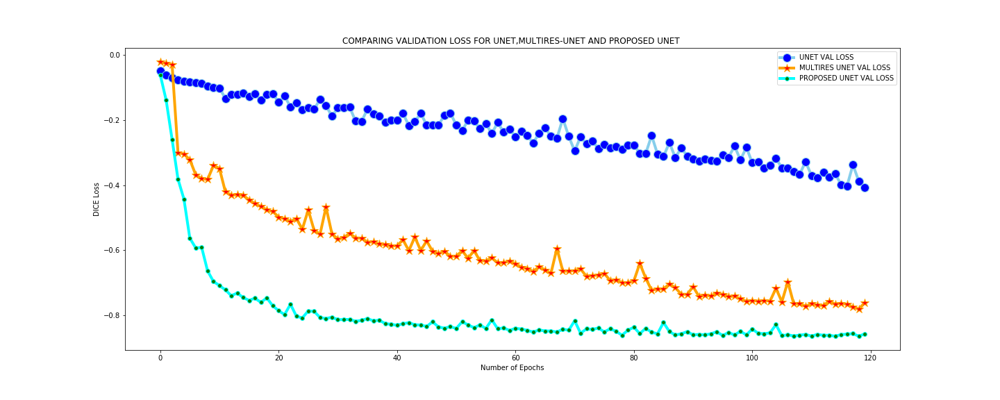
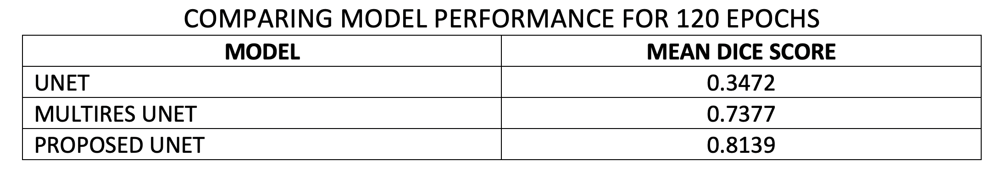
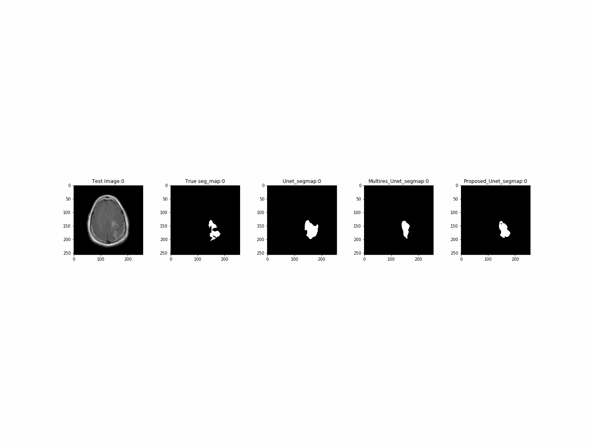
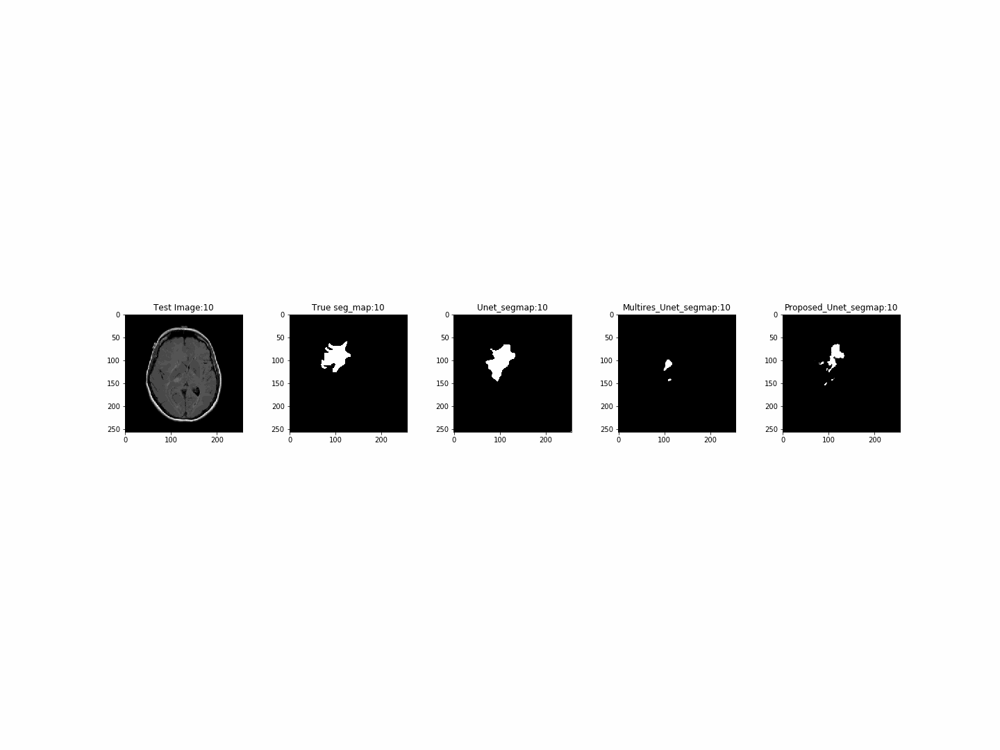

# BRAIN-TUMOR-SEGMENTATION

# BRAIN TUMOR SEGEMENTATION OF LOW GRADE GLIOMAS

Created by:
[Naveen Balaraju](https://github.com/naveenbalaraju?tab=repositories)

1. The objective of this project is to develop and automatic Image segmentaion algorithm to detect the low grade brain tumors. 
2. Recent studies have discovered that low grade gliomas are associated with the genomic subtypes that have a particular feature shape and by analyzing the feature shape we can predict which genomic subtype that was responsible for the development of the brain tumor. 
3. The conventional way to findout the genomic subtype is by making a biopsy which involves making and incision into the skull and collecting the tissue from the tumor site which involves a huge amount of risk factors.For more details we encougare you to read the referenced paper below.

# MODEL ARCHITECTURE
Implemented Three models "U-net", "MultiRes Unet" and a model porosped named it as "Proposed Unet Model" and their respective architectures can be found below.

# U-NET

# MULTIRES U-NET

# PROPOSED U-NET

# METRICS AND LOSS PLOTS
# TRAIN DICE SCORE

# VALIDATION DICE SCORE

# TRAIN LOSS

# VALIDATION LOSS

# TEST RESULTS

 Note: The Unet model trained for 360 epochs gives a mean Dice score of 0.8242

# BEST SEGEMENTATION MAPS GENERATED BY MODELS

# AVERAGE SEGEMENTATION MAPS GENERATED BY MODELS

# REFERENCES
1. Paper1: https://arxiv.org/pdf/1902.04049.pdf
2. Paper2: https://arxiv.org/pdf/1906.03720.pdf
3. Image pre-processing: https://keras.io/preprocessing/image/
4. Data Augmentation: https://fairyonice.github.io/Learn-about-ImageDataGenerator.html
5. Dice Coefficient: https://www.ncbi.nlm.nih.gov/pmc/articles/PMC1415224/figure/F1/
6. Author Github Link: https://github.com/MaciejMazurowski/brain-segmentation
7. Dataset: https://www.kaggle.com/mateuszbuda/lgg-mri-segmentation
